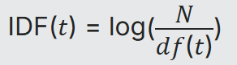

# Тестовое задание для Леста Старт.

_TF_ - Сколько раз слово встречается в загруженном файле.

_IDF_ - 

Где _N_ — общее количество документов в системе.

_df(t)_ — количество документов, содержащих слово _t_.

# Для запуска на локальном компьютере.
1. Склонируйте репозиторий.
2. Создайте и активируйте виртуальное окружение `python -m venv myenv`, `myenv\Scripts\activate`.
3. Установите зависимости `pip install req.txt`.
4. Выполните миграции `python manage.py migrate`.
5. Запустите сервер `python manage.py runserver`.

# Начало использования.

Выполните команды:

1. Для начала пользования выполните `make start`.
2. Для остановки приложения `make stop`.
3. Для тестирования выполните `make test`, но прежде чем запускать `make test`, выполните команды `make venv`, `source venv/bin/activate`,`make install`.

DOCUMENTATION API - http://127.0.0.1:8000/swagger/

# Использование сервиса.

Перейдите по адресу http://127.0.0.1:8000/documents/upload/

Загрузите документ и дайте ему название.

После выполнения запроса, Вы, получаете результат 50 слов с наибольшим _IDF_.
После загрузки одного(первого) документа _IDF_ будет равен 0, потому что документ в системе только один.

Как только вы загрузите второй документ, Вы, получите значения _IDF_ для слов.

# Использованные технологии.

1. Django
2. PostgreSQL
3. Docker
4. Docker Compose
5. Pytest

### _Надеюсь, Вы, получите удовольствие от использования проектом, как и я, когда писал его :)_